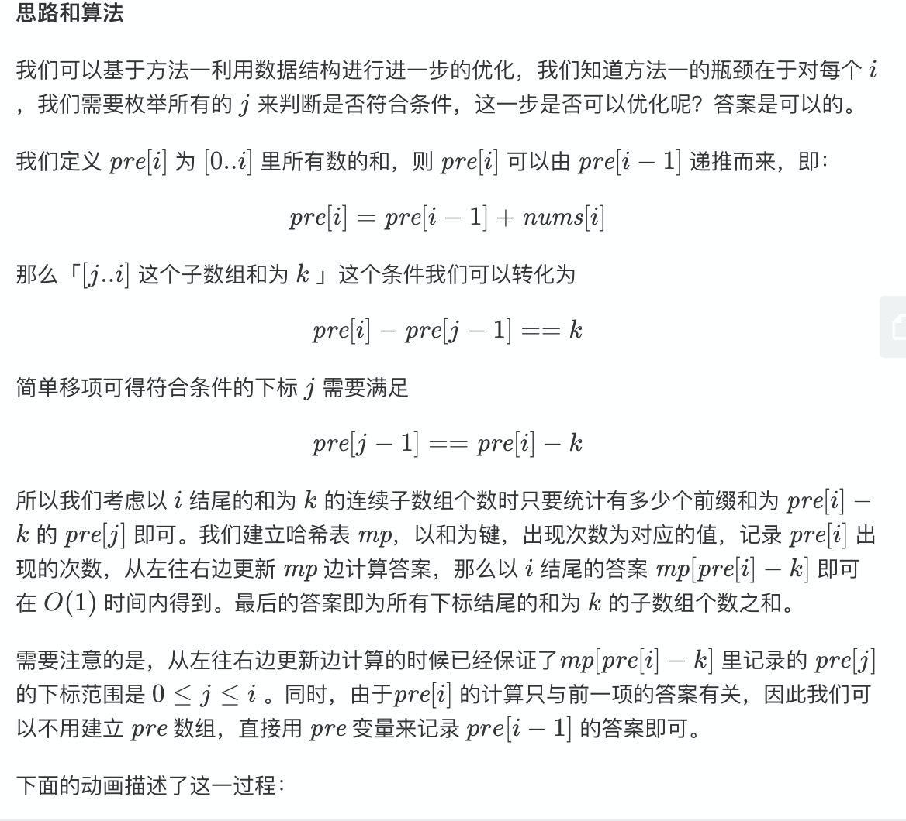
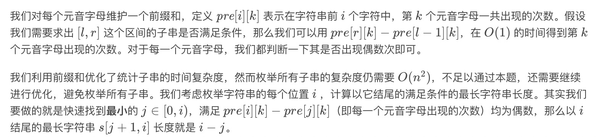
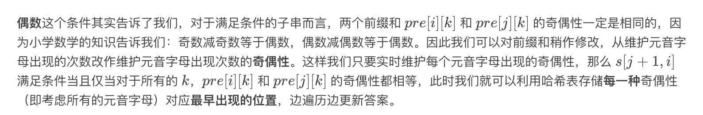

# 每日一题

#### [560. 和为K的子数组](https://leetcode-cn.com/problems/subarray-sum-equals-k/)

没有考虑负数啊，感觉应该排序

```javascript
var subarraySum = function(nums, k) {
	let total = 0
  let cur
  for (let i = 0;i < nums.length; i++) {
    cur = 0
    for (let j = i;j < nums.length;j++) {
      cur += nums[j]
      if (cur === k) {
        total++
      }
    }
  }
  return total
};
```

哈希表，递推

pre -> pre自身

```javascript
var subarraySum = function(nums, k) {
    const mp = new Map();
    mp.set(0, 1);
    let count = 0, pre = 0;
    for (const x of nums) {
        pre += x;
        if (mp.has(pre - k)) count += mp.get(pre - k);
        if (mp.has(pre)) mp.set(pre, mp.get(pre) + 1);
        else mp.set(pre, 1);
    }
    return count;
};
```

先找规律，然后倒推，看了N遍递推还是不会，感觉没有get到点，有个点没有打通




核心思想：[j...i]的子集

pre[i] = pre[i-1] + nums[i]

k = pre[i] - pre[j-1]

pre[j-1]=pre[i] - k 

例如：

1234    3

[1,2] pre[0] = pre[2] - k

1 = 6 - 3

[0,1]

[2]

题解是有可能看不懂的，那么就要自己挖掘新思路去理解

核心是这里只计算次数，不关心具体数组

累加器

递推公式

1

1 2

1 2 3

1 2 3 4

```javascript
var subarraySum = function(nums, k) {
  const map = new Map()
  let count = 0
  let pre = 0
  map.set(pre, 1)
  for (const num of nums) {
    pre += num
    if (map.get(pre - k)) count += map.get(pre - k)
    if (map.has(pre)) map.set(pre, map.get(pre) + 1)
    else map.set(pre, 1)
  }
  return count
}
```


#### [1371. 每个元音包含偶数次的最长子字符串](https://leetcode-cn.com/problems/find-the-longest-substring-containing-vowels-in-even-counts/)

感觉有可以递归，或者回溯，或者我把出现的下标记下来，然后截取最大的情况

肯定是O(n)，先把数据准备好，我需要一种数据结构可以存储这种类型的数据

下标，字符

message 每一个元音字符的位置

但是又不是单个字符的位置决定的

1 2  1 1 2

1 [0,2,3]

2 [1.4]

s [0, 4] \[1, 4\]\[1, 3\] [2, 3]

所以题解里面给出了位运算的方式，不过我还没有弄明白位运算怎么使用


JS中二进制为字符串表示


JS如何进行进制转换?


toString(2)


parseInt(, 2)

// 2是代表现在的状态，不是目标进制


核心矛盾

1. 最长子字符串的长度
2. 偶数次


1. 它判断的是奇偶性，简化逻辑，反向推理[j, i]
2. 它利用了位运算，替代hash

前缀和

**奇数减奇数等于偶数，偶数减偶数等于偶数**






逻辑绕绕就绕糊涂了

| 运算符                                                       | 用法      | 描述                                                         |
| :----------------------------------------------------------- | :-------- | :----------------------------------------------------------- |
| [按位与（ AND）](https://developer.mozilla.org/zh-CN/docs/Web/JavaScript/Reference/Operators/Bitwise_Operators#Bitwise_AND) | `a & b`   | 对于每一个比特位，只有两个操作数相应的比特位都是1时，结果才为1，否则为0。 |
| [按位或（OR）](https://developer.mozilla.org/zh-CN/docs/Web/JavaScript/Reference/Operators/Bitwise_Operators#Bitwise_OR) | `a | b`   | 对于每一个比特位，当两个操作数相应的比特位至少有一个1时，结果为1，否则为0。 |
| [按位异或（XOR）](https://developer.mozilla.org/zh-CN/docs/Web/JavaScript/Reference/Operators/Bitwise_Operators#Bitwise_XOR) | `a ^ b`   | 对于每一个比特位，当两个操作数相应的比特位有且只有一个1时，结果为1，否则为0。 |
| [按位非（NOT）](https://developer.mozilla.org/zh-CN/docs/Web/JavaScript/Reference/Operators/Bitwise_Operators#Bitwise_NOT) | `~ a`     | 反转操作数的比特位，即0变成1，1变成0。                       |
| [左移（L](https://developer.mozilla.org/zh-CN/docs/Web/JavaScript/Reference/Operators/Bitwise_Operators#Left_shift)[eft shift）](https://developer.mozilla.org/zh-CN/docs/Web/JavaScript/Reference/Operators/Bitwise_Operators#Left_shift) | `a << b`  | 将 `a` 的二进制形式向左移 `b` (< 32) 比特位，右边用0填充。   |
| [有符号右移](https://developer.mozilla.org/zh-CN/docs/Web/JavaScript/Reference/Operators/Bitwise_Operators#Right_shift) | `a >> b`  | 将 a 的二进制表示向右移` b `(< 32) 位，丢弃被移出的位。      |
| [无符号右移](https://developer.mozilla.org/zh-CN/docs/Web/JavaScript/Reference/Operators/Bitwise_Operators#Unsigned_right_shift) | `a >>> b` | 将 a 的二进制表示向右移` b `(< 32) 位，丢弃被移出的位，并使用 0 在左侧填充。 |

##### 前缀和

补码等于反码+1，形成负对应值

因为结果求的也是长度

```javascript
// 顺序如何保障，如何保障越后面结果越有效，不丢失有效的结果
// 两次位运算就把我绕糊涂了 第一次是按位异或，取按位异或结果，找到pos结果然后an'wei
var findTheLongestSubstring = function(s) {
    const n = s.length;
    const pos = new Array(1 << 5).fill(-1);
    // status并不是代表单个字符出现的次数，而是当前结果和新字符串按位异或的结果，是为了抵消奇偶性
    // 10000   00001        10001
    let ans = 0, status = 0;
    pos[0] = 0;
    for (let i = 0; i < n; ++i) {
        const ch = s.charAt(i);
        if (ch === 'a') {
            status ^= 1<<0;
        } else if (ch === 'e') {
            status ^= 1<<1;
        } else if (ch === 'i') {
            status ^= 1<<2;
        } else if (ch === 'o') {
            status ^= 1<<3;
        } else if (ch === 'u') {
            status ^= 1<<4;
        }
       // 这一步的判断是什么意思？ 这一步和上面的pos[0]=0相对应，是为了判断奇偶性 p[0] = 0 
        if (~pos[status]) { 
          	// i + 1 - pos[status] ?? 长度  i + 1代表的是当前的长度，因为i是从0开始的 pos[status]越小 i 结果越大
            ans = Math.max(ans, i + 1 - pos[status]); 
        } else {
            // i + 1让长度累加
            pos[status] = i + 1;
        }
    }
    return ans;
};

findTheLongestSubstring("eleetminicoworoep")
```

##### 位运算

```js
var findTheLongestSubstring = function(s) {
  const n = s.length
  const pos = new Array(1 << 5).fill(-1) // pos为什么从-1开始 因为~1 = 0
  let ans = 0, status = 0
  pos[0] = 0
  for (let i = 0;i < n; i++) {
    const ch = s.charAt(i)
    if (ch === 'a') {
      status ^= 1 << 0
    } else if (ch === 'e') {
      status ^= 1 << 1
    } else if (ch === 'i') {
      status ^= 1 << 2
    } else if (ch === 'o') {
      status ^= 1 << 3
    } else if (ch === 'u') {
      status ^= 1 << 4
    }
    // 这个循环会一直执行 也就是说status不变的情况下会一直累加
		console.warn('loop:', ch, status, status.toString(2), pos[status], i)
    if (~pos[status]) { // 
      ans = Math.max(ans, i + 1 - pos[status]) // 2. 两步一起保证，pos[status]越大。值越小的机制，-1 > 0
			console.log('ans', ans, i + 1, pos[status])
    } else { // 当pos[status] = -1时进来，也就是status第一次访问的时候进来
      // 这里保存的是前缀和
      pos[status] = i + 1
      console.log(pos)
    }
  }
  return ans
}
// status的变化是核心
findTheLongestSubstring("eleetminicoworoep")
```


子字符串 ，长度为1，子串为0

特性1：奇数 + 奇数 = 偶数

那为什么o会影响整个结果呢

因为整体奇偶性发生了变化

```javascript
// 这个地方设计得非常巧妙， 当~pos[status]为奇数
if (~pos[status]) { // 
      ans = Math.max(ans, i + 1 - pos[status])
			console.warn('ans', ans, i + 1, pos[status])
    } else {
      pos[status] = i + 1
      console.log('pos', status.toString(2), i+1, pos)
    }
```


前缀和模板

前缀和中pre是关键值

```javascript
[i, j] = p[i] - p[j-1]

const map = {}

let pre

let count

let k

for (let i = 0;i < arr.length;i++) {

	if (map[pre - k]) count += map[pre-k]

	if (map[pre]) {
		map[pre] += 1
	} else {
    map[pre] = 1
  }

}
```

因为a[8]不存在，a[8]为什么不存在？因为前缀的奇偶性发生了变化

只要存在


pos[status]保存的是前缀和的长度

```javascript
var  findTheLongestSubstring = function(s) {
  let ans = 0, status = 0
  const n = s.length
  const pos = new Array(1 << 5).fill(-1)
  pos[0] = 0
 
  for (let i = 0;i < n;i++) {
    const c = s.charAt(i);
    switch (c) {
      case 'a':
        status ^= 1 << 0
        break;
      case 'e':
        status ^= 1 << 1
        break;
      case 'i':
        status ^= 1 << 2
        break;
      case 'o':
        status ^= 1 << 3
        break;
      case 'u':
        status ^= 1 << 4
        break;
      default:
        break;
    }
    if (~pos[status]) {
      ans = Math.max(ans, i + 1 - pos[status])
    } else {
      pos[status] = i + 1
    }
  }
  return ans
  
}
```

再写一遍

从前往后遍历，如果满足条件就返回长度，如果不满足条件就只增加长度

如何解决中段问题？前缀和**最小**的 j \in [0,i)*j*∈[0,*i*)，满足 pre\[i\]\[k\]-pre\[j\]\[k\]     *p**r**e*\[*i*\]\[*k*\]−*p**r**e*\[*j*\]\[*k*\]

统计次数

前缀和->奇偶性->位运算

#### 前缀和 + 状态压缩

标题的信息量比较大

```javascript
var findTheLongestSubstring = function(s) {
  const n = s.length;
  const pos = new Array(1 << 5).fill(-1);
  let ans = 0, status = 0;
  pos[0] = 0;
  const w = {
    a: 0,
    e: 1,
    i: 2,
    o: 3,
    u: 4
  }
  for (let i = 0;i < n;i++) {
    const ch = s.charAt(i);
		if (w[ch] != null) {
      status ^= 1 << w[ch];
    }
    if (~pos[status]) {
      	ans = Math.max(ans, i + 1 - pos[status])
    } else {
      pos[status] = i + 1
    }
  }
  return ans
}
// status的变化是核心
findTheLongestSubstring("eleetminicoworoep")
```

